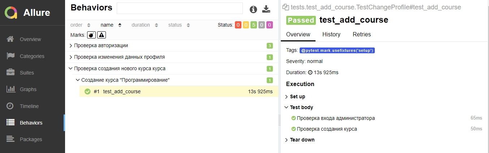

# python-selenium-example

UI testing for [Moodle LMS](https://sandbox.moodledemo.net/) using Python, Selenium, Allure and Page Object design pattern.

Install the requirements:

`pip install -r requirements.txt`

Run tests:

`pytest tests\  --alluredir report`